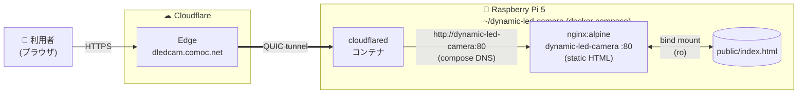

# Dynamic LED Camera

スマホ / PC のカメラで**バースト撮影 → 多重合成**し、点滅LEDの残像や長時間露光風の1枚絵を得る静的Webアプリ。`getUserMedia` + `Canvas` のみで動作し、サーバ側処理は一切なし。

公開: **https://dledcam.comoc.net/**

## 特徴

- **3種の合成モード**
  - `max` — チャンネルごとの最大値 (既定、LED軌跡向き)
  - `maxLum` — 輝度最大のピクセルを採用
  - `mean` — 平均値 (ノイズ低減)
- **フレーム数**: 1〜50枚 (撮影ボタン1回で連続取得)
- **カメラ切替**: 前面/背面 + 複数カメラ時は `deviceId` 選択
- **手動露光**: `track.applyConstraints` による露光固定 (対応端末のみ)
- **PNG保存**: ワンタップでダウンロード
- **HTTPS必須**: `getUserMedia` 制約上、Cloudflare Tunnelで自動HTTPS化

## 動作要件

- カメラ付きデバイス (iOS Safari 14+ / Android Chrome / デスクトップChrome・Edge・Firefox)
- HTTPS または `localhost` 配信
- 60fps取得は対応端末のみ (非対応時は自動的に端末上限にフォールバック)

## システム構成



ingress rules は `cloudflared/config.yml` でローカル管理。

## セットアップ

### 前提

- Docker / Docker Compose
- Cloudflare アカウントと管理下のドメイン
- Zero Trust ダッシュボードで発行した Tunnel Token

### 手順

1. 設定ファイル準備

   ```sh
   cp .env.example .env
   # TUNNEL_TOKEN=eyJh... を Zero Trust ダッシュボードからコピーして貼り付け
   ```

2. `cloudflared/config.yml` の `hostname` を自分のドメインに書き換え

   ```yaml
   ingress:
     - hostname: your-subdomain.example.com
       service: http://dynamic-led-camera:80
     - service: http_status:404
   ```

3. Cloudflare DNS に CNAME を追加
   - Name: `your-subdomain`
   - Target: `<tunnel-uuid>.cfargotunnel.com`
   - Proxy status: **Proxied (オレンジ雲ON)**

4. 起動

   ```sh
   docker compose up -d
   ```

5. 疎通確認

   ```sh
   curl -I https://your-subdomain.example.com/
   docker compose logs -f cloudflared   # Registered tunnel connection が4本出ればOK
   ```

## ファイル構成

```
.
├── docker-compose.yml        # nginx + cloudflared
├── nginx/default.conf        # Cache-Control: no-cache
├── cloudflared/config.yml    # ingress rules
├── public/index.html         # アプリ本体 (単一HTML + inline JS/CSS)
├── .env.example
└── .gitignore
```

## 編集ワークフロー

`public/index.html` を編集して保存するだけで即反映 (nginxはディレクトリを `:ro` でバインドマウント、`Cache-Control: no-cache` でCloudflare / ブラウザが毎回再検証)。

コンテナ再起動は通常不要。nginx/cloudflared の設定を変えた時だけ `docker compose up -d` を実行。

## ライセンス

MIT
